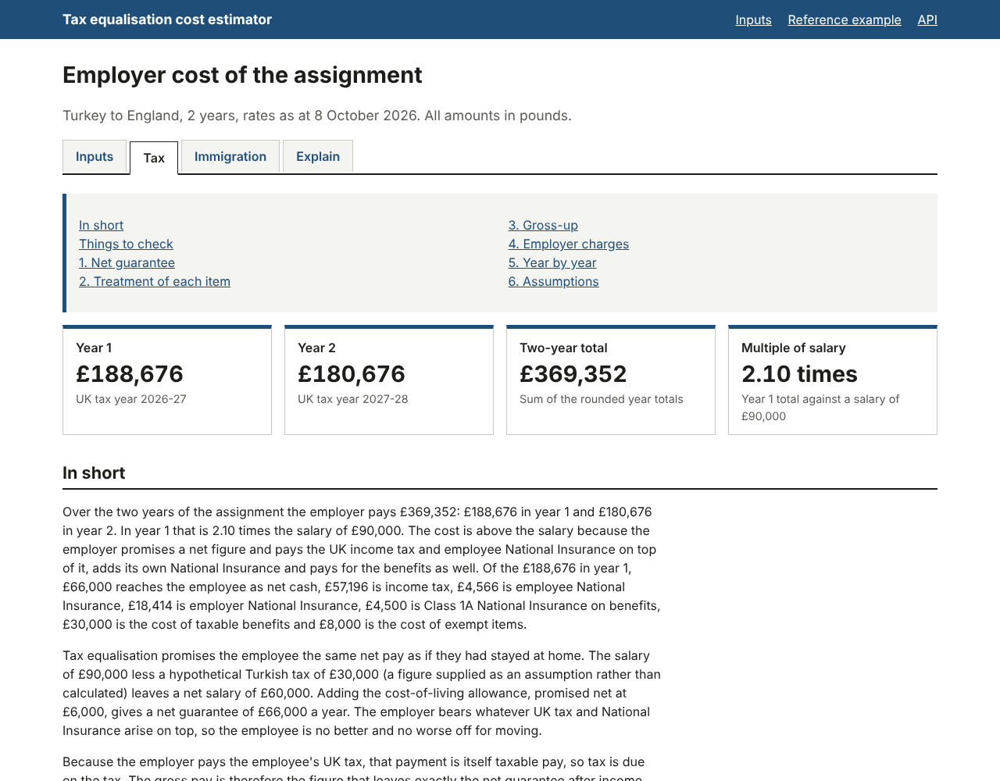
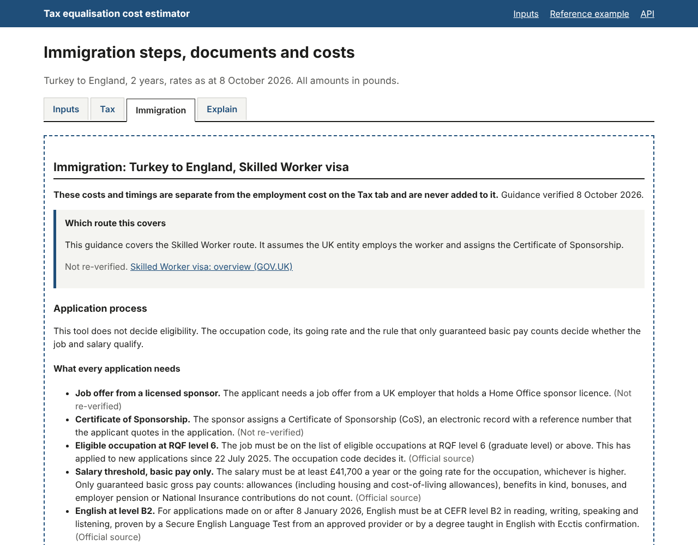

# Tax Equalisation Cost Estimator

[](https://github.com/byrm-tsn/Tax-Equalisation/actions/workflows/ci.yml)

An estimator of what it costs an employer, and how long it takes, to move an employee from Turkey to England for two years under tax equalisation. It grosses up the employee's net guarantee through UK income tax and National Insurance, adds the employer's charges and benefits year by year, sets out the UK Skilled Worker immigration steps, costs and timeline separately, and explains the result in plain English. The worked example in the brief reproduces to the pound. "teq", in the package names, is short for tax equalisation.

## What it does

For a scenario (route, assignment length, salary, hypothetical home tax and the package), the tool produces three outputs, each on its own tab:

1. **The employment cost** (Tax tab): the cost to the employer for each year and in total, built up in the brief's order: the net guarantee, the treatment of each item, the gross-up, the employer charges and a year-by-year table, followed by the assumptions with a question to confirm each.
2. **The immigration route** (Immigration tab): the Skilled Worker process in order, the documents, the costs with who pays each, and a timeline given as a range from the critical path. These costs are kept apart from the employment cost and never added to it.
3. **The explanation** (Explain tab): a plain-English account of the tax, the cost and the immigration steps, the step-by-step calculation trace with HMRC manual references, and the provenance of every rate used.



## The brief and the reference example

The brief is a four-page reference pack. It asks for the cost and timing of a two-year move from Turkey to England under tax equalisation, an immigration output and a plain-English explanation, and gives a worked example. The tool reproduces that example to the pound:

| Inputs | | Outputs (each year unless stated) | |
|---|---|---|---|
| Salary | £90,000 | Gross cash pay | £127,762 |
| Hypothetical Turkish tax (supplied) | £30,000 | Income tax | £57,196 |
| Cost-of-living allowance, paid net | £6,000 a year | Employee National Insurance | £4,566 |
| Housing, a taxable benefit | £30,000 a year | Employer National Insurance | £18,414 |
| Relocation, exempt up to £8,000 | £8,000 in year 1 | Class 1A National Insurance | £4,500 |
| Assignment | 2 years, England, 2026/27 rates | Year 1 / year 2 | £188,676 / £180,676 |
| | | Two-year total | £369,352 |

The rounding policy is stated with every result. The gross pay is solved exactly (£127,761.51) and rounded up to the pound, so the net guarantee of £66,000 is never short (the employee receives £66,000.26); every line is recalculated on the rounded gross and rounded to the pound; totals are sums of rounded lines, so every table adds up. The two-year total of £369,352 is the sum of the rounded years; the unrounded years sum to £369,351.47.

The reference pack supplies the hypothetical tax as £30,000 and notes that the tool should work it out. Calculated from the 2026 Turkish rules at an indicative 65.7 lira to the pound, it is £34,212.20; the Tax tab shows both and recalculates in one click, and a new scenario calculates it by default.

## Quick start

Requires Python 3.13.

```bash
python3.13 -m venv .venv
source .venv/bin/activate
pip install -e ".[dev,web]"
python src/manage.py migrate      # no models: this only creates the empty SQLite file /readyz checks
python src/manage.py runserver
```

Then open <http://127.0.0.1:8000/example>.

The `Makefile` wraps the common tasks, using the virtual environment in `.venv`:

| Target | What it runs |
|---|---|
| `make install` | Creates `.venv` and installs the project with the development and web extras |
| `make check` | `lint`, `typecheck` and `test` in turn: the same steps as continuous integration |
| `make lint` | `ruff check` and `ruff format --check` on `src` and `tests` |
| `make typecheck` | Strict `mypy` on the three packages |
| `make test` | `pytest -q` |
| `make run` | Runs `migrate`, then starts the development server |
| `make example` | Prints the reference example in the terminal |

## Using it

### Pages

| Path | What it shows |
|---|---|
| `/` | The input form: route, assignment length, rates date, salary, hypothetical tax (calculated by default, at an indicative exchange rate to confirm), the package, extra items, social security and the exchange rate |
| `/example` | The reference example's results |
| `/estimate?s=...&tab=...` | The results for the encoded inputs, one tab per request: `tax` (the default), `immigration` or `explain`. The inputs live in the link, so a result reloads and can be shared without a database. Answers to the immigration tailoring questions are added to the query string and carry across the tabs |
| `/compare?s=...` | The same scenario under UK National Insurance and under the Turkish scheme, side by side |



### API

| Method and path | Purpose |
|---|---|
| `POST /api/v1/estimates` | Calculate an estimate; money is sent and returned as decimal strings |
| `GET /api/v1/estimates?s=...` | The estimate for an encoded results link |
| `GET /api/v1/routes` | Supported routes |
| `GET /api/v1/reference-example` | The reference scenario, as a request body |
| `GET /api/v1/warnings` | The catalogue of warning and assumption codes |
| `GET /api/v1/docs` | Interactive documentation (OpenAPI schema at `/api/v1/openapi.json`) |

Errors are RFC 9457 problem details. An unsupported route is refused with a 422 that lists the supported routes.

### Operations

| Path | Purpose |
|---|---|
| `/healthz` | The process is up |
| `/readyz` | The rate sets and the guidance pack load and validate (503 if not); the database is reported too, and an unreachable database or an unapplied migration shows as degraded rather than down |
| `/selftest/golden` | Runs the reference example and checks it against the reference pack to the pound; protected by a token when `SELFTEST_TOKEN` is set |

### Command line

```bash
python src/manage.py estimate --example                 # the reference example as a table
python src/manage.py estimate --example --json          # the full result as JSON
python src/manage.py estimate --input scenario.json     # a scenario in the POST /api/v1/estimates format
```

### From Python

The engine and the guidance package have no Django dependency:

```python
from teq_engine import calculate, default_provider, reference_example
from teq_engine.reference import REFERENCE_RATES_AS_OF
from teq_guidance import TailoringAnswers, build_panel

result = calculate(reference_example(), default_provider(), rates_as_of=REFERENCE_RATES_AS_OF)
result.totals.total_employer_cost                                 # Decimal('369352')

panel = build_panel(TailoringAnswers.reference_example())
panel["costs"]["subtotals_display"]["employer_mandatory"]         # '£3,165'
panel["timeline"]["total_text"]                                   # 'about 6 to 16 weeks (43 to 112 days)'
```

## How it works

The code is three packages. [docs/ARCHITECTURE.md](docs/ARCHITECTURE.md) describes the production design they belong to and how this repository maps onto it.

**`teq_engine`** is pure Python with pydantic models: no Django, no I/O during a calculation and no clock. Money is `Decimal` throughout and floats are refused. Net pay is a continuous, piecewise-linear and strictly increasing function of gross pay, so the gross-up is solved exactly on the segment that contains the net guarantee and cross-checked against the fixed-point iteration the reference pack describes, with bisection as a fallback. Rates are YAML rate sets with effective dates and sources, carried forward with a notice when a later year is not yet published. A Turkish module calculates the hypothetical tax (income tax, social security and stamp tax). Every result carries coded warnings and assumptions from one catalogue, a numbered calculation trace, the rate sets and engine version it used (0.2.0) and a hash of its inputs. A route registry refuses anything other than Turkey to England with an explanation, never a guess.

**`teq_guidance`** uses the standard library only. The Skilled Worker guidance is data: a JSON pack of requirements, documents, costs and timeline stages, each with a condition on the tailoring answers, a GOV.UK source and a verification level. Costs are formulas with a basis (fixed, per visa year, per dependant), tiers, a payer and a flag for costs that cannot be passed to the worker. The timeline is a dependency graph whose critical path is computed at the minimum and maximum durations and shown as a range, never a date. The loader refuses an inconsistent pack and names every problem.

**`teq_web`** is a Django 5.2 project, server-rendered with no JavaScript. The pages, the API (Django Ninja) and the management command all call one service. The form posts and redirects to a results URL that carries the encoded inputs, so there is no database to keep. The template narrator writes the plain-English explanation, and a test checks that every number it states appears in the result or the guidance panel.

## Verification

[docs/VERIFICATION.md](docs/VERIFICATION.md) records what is tested and how. In summary:

- **Tests.** 676 as of 8 October 2026: 279 engine, 113 guidance and 284 web. Ruff, the formatting check and strict mypy are clean on all three packages, and all of them run in continuous integration on every push and pull request.
- **Golden corpus.** Nine cases in `tests/golden/`: the reference example to the pound, relocation above the cap, home-scheme social security, the personal allowance taper band, income below the allowance, the calculated hypothetical tax, and three refusals. Each records the engine version it was computed with, so a golden figure cannot change without the golden files and the engine version changing with it.
- **Property and boundary tests.** Hypothesis tests of the solver's invariants (the exact gross meets the guarantee and one penny less does not; the gross rises with the target and with benefits; the segment solve, bisection and the iteration agree to the penny; no float appears in a result), and every threshold tested at its value and one penny either side.
- **Independent reviews.** Two independent reviews of the finished code, one of the engine and guidance packages and one of the web layer, each looking for wrong figures first. The engine review found no wrong tax or National Insurance figure; the defects the reviews did find were fixed, each with a regression test.
- **Hand recomputation.** The reference example is recomputed by hand, line by line, in section 7 of the verification document, with the indicative Turkish hypothetical tax and the immigration costs.
- **Sources.** Section 6 lists which immigration facts are traced to the official page, which are third-party reports that need checking on GOV.UK (the April 2026 visa and sponsor fees among them), and which have not been re-verified.

## Assumptions and limitations

[docs/ASSUMPTIONS.md](docs/ASSUMPTIONS.md) explains every assumption and warning code. The main ones:

- Each assignment year is one whole UK tax year and one Turkish calendar year; actual dates and split years are not modelled.
- England only, on one route (Turkey to the UK). Scotland and other routes are refused rather than calculated at the wrong rates.
- UK rates for 2027/28 are not yet published, so the 2026/27 rates are carried forward (UK thresholds are frozen to 2030/31 in any case).
- The reference pack's £30,000 hypothetical tax is the most material assumption; the calculated figure is shown beside it.
- Housing is taken at the cash value entered; the statutory valuation of living accommodation is not performed.
- National Insurance is calculated annually; the Employment Allowance and Overseas Workday Relief are not applied; pension auto-enrolment and the Apprenticeship Levy are flagged but not costed.
- The immigration guidance covers the Skilled Worker route only, never decides eligibility, and uses fees and timings as at 8 October 2026.
- One tenant, no login and nothing saved: results live in their links.

## Extending to another country or route

1. **Rate sets.** Add the rates as YAML under `src/teq_engine/ratesets/data/<jurisdiction>/` (as `gb/income_tax_2026_27.yaml` and `tr/sgk_2026.yaml` do), each with its effective dates, sources and verification date; `src/teq_engine/ratesets/schemas.py` validates them when the provider loads. Write jurisdiction functions under `src/teq_engine/jurisdictions/<code>/` only where the rules differ in shape, not just in numbers: a Scottish income tax set reuses the UK functions, while a new home country needs its own hypothetical-tax module like `jurisdictions/tr/hypo.py`.
2. **Route registry.** Add the route to `SUPPORTED_ROUTES` and `_SPECS` in `src/teq_engine/routes/registry.py`, mapping it to its rate-set jurisdictions. The refusal page, the form's refusal message and `GET /api/v1/routes` read the registry, so they update themselves; the names shown in prose are in `src/teq_web/scenarios/capability.py`.
3. **Guidance pack.** Add a JSON pack under `src/teq_guidance/data/` (start from `tr_gb_skilled_worker.json`: sources, tailoring questions, requirements, stages, documents, costs with their payers), list its file in `_PACK_FILES` in `src/teq_guidance/loader.py`, and select it for the route in `build_immigration` in `src/teq_web/scenarios/services.py` (with one route, the Turkey to UK pack is always used). The loader refuses an inconsistent pack and names every problem.
4. **Golden case.** Add a case under `tests/golden/` with the inputs and the figures recomputed by hand; `tests/engine/test_golden.py` runs every file there.

The templates and the API need no change; the form needs one only for a country code that is not already in its lists (`_HOME_CODES` and `_HOST_CODES` in `src/teq_web/scenarios/forms.py`).

## Project layout

```
src/teq_engine/      calculation engine: money and rounding, UK income tax, NICs and benefit
                     rules, Turkish hypothetical tax, gross-up solver, periods, warnings
                     catalogue, trace, route registry, rate sets (YAML), reference example
src/teq_guidance/    immigration guidance (standard library only): the Turkey to UK Skilled
                     Worker pack (JSON), loader, tailoring, cost formulas, timeline, panel
src/teq_web/         Django project: pages and templates, API, operations endpoints,
                     narration, management command
src/manage.py        Django entry point
tests/engine/        engine unit, property and boundary tests
tests/golden/        golden corpus: inputs and expected figures
tests/guidance/      guidance pack, costs, tailoring, timeline and panel tests
tests/web/           pages, forms, API, narration, command and operations tests
docs/                architecture, assumptions, verification, walkthrough, screenshots
.github/workflows/   continuous integration
Makefile             common tasks
CHANGELOG.md         changes by version
```

## Documentation

- [Architecture](docs/ARCHITECTURE.md): the production design, the part of it this repository implements, and how one maps to the other.
- [Assumptions](docs/ASSUMPTIONS.md): every assumption and warning code in plain English, and where the reference pack differs from current guidance.
- [Verification](docs/VERIFICATION.md): what is tested and how, the hand recomputation of the reference example, which facts have not been re-verified, and the independent reviews.
- [Walkthrough and design notes](docs/WALKTHROUGH.md): a ten-minute walkthrough of the tool, design questions and answers, and open questions for the brief's authors.
- [Changelog](CHANGELOG.md): what changed in each version.

## Approach

The brief and the official sources were researched first, and a written design, now [docs/ARCHITECTURE.md](docs/ARCHITECTURE.md), preceded the code. The build used AI-assisted coding tools. Every figure in the reference example was then recomputed by hand, and the code was put through two independent reviews whose findings were fixed.

## Disclaimer

This is an illustration, not tax or immigration advice. Rates, fees and processing times change. Each figure carries its source and verification status, and the immigration guidance shows the date it was verified; check the figures with a tax adviser and the immigration steps on GOV.UK before relying on them.
