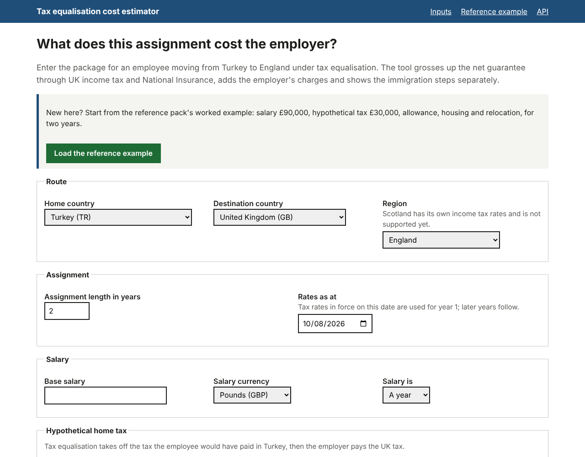
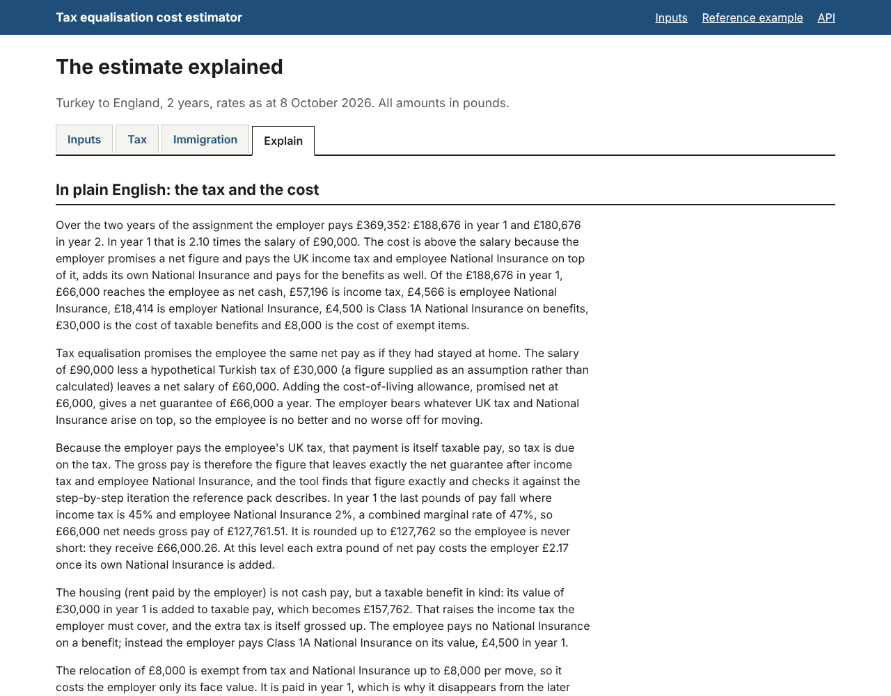

# Walkthrough and design notes

A ten-minute walkthrough of the tool on the reference example; the design questions it raises, with short answers; what is implemented, verified, simplified and left for later; and the questions still open for the brief's authors.

To follow along, start the app (see the [README](../README.md#quick-start)), open `/example` and keep a terminal open in the repository root. Screenshots of the four views are in [`docs/images/`](images/).

---

## A ten-minute walkthrough

### 1. What the tool answers

- "What does it cost the employer, and how long does it take, to move this employee from Turkey to England for two years under tax equalisation?"
- The engine is deterministic and pure: the same inputs and rate tables always give the same figures, and every figure carries its rule version, assumptions and a trace.
- Everything shown is an illustration, not tax or immigration advice.

### 2. The reference example on the Tax tab

`/example` loads the reference scenario (salary £90,000, hypothetical tax £30,000, cost-of-living allowance £6,000 net, housing £30,000, relocation £8,000 in year 1). It opens on the **Tax** tab; the tab bar reads Inputs, Tax, Immigration, Explain, and the lead line reads "Turkey to England, 2 years, rates as at 8 October 2026". The screenshot is [`images/tax-tab.png`](images/tax-tab.png).

1. **Headline.** Year 1 **£188,676**, year 2 **£180,676**, total **£369,352**, 2.10 times salary. These match the reference pack to the pound.
2. **In short.** Three paragraphs: what it costs and why it is more than the salary, the net guarantee, and the gross-up. The link under them opens the full explanation on the Explain tab.
3. **Things to check.** One line each, with no warning cards for this scenario: UK rates for 2027-28 are not yet published, so the 2026-27 rates are carried forward (the reference pack's own assumption; Turkish rates are not mentioned because a supplied hypothetical tax does not use them); the social security agreement may apply; pension auto-enrolment and the Apprenticeship Levy may add to the cost.
4. **Net guarantee.** £90,000 less £30,000 hypothetical tax, plus the £6,000 net allowance: £66,000 in the employee's pocket each year.
5. **Calculate it from the 2026 Turkish rules instead.** The link beside the supplied £30,000 reopens the same scenario with the hypothetical tax calculated, at an indicative 65.7 lira per pound dated 15 September 2026 (flagged as a rate to confirm). The hypothetical tax becomes **£34,212.20**, the net guarantee £61,787.80 and year 1 **£179,536** (total £351,072). The reference pack's £30,000 is the most material assumption, and the tool can work it out instead. The rest of the walkthrough uses the reference example.
6. **Item treatment.** The reference pack's three labels: taxable cash (the allowance, grossed up), taxable benefit in kind (housing: income tax and Class 1A, no employee NICs), exempt (relocation, within the £8,000 cap per move).
7. **Gross-up.** Gross cash £127,762. Every extra pound here is taxed at 45% plus 2% NICs, so delivering £66,000 net takes £127,762 gross; the guarantee is never under-delivered (the employee actually receives £66,000.26).
8. **Employer charges, the year-by-year table and the assumptions.** Employer NICs £18,414 and Class 1A £4,500; every table adds up. The assumptions open with the five the reference pack asks for, in its order (UK residence, which National Insurance applies, Overseas Workday Relief, England rather than Scotland, the tax year), each with a question to confirm it; the rest follow under "Further assumptions".

### 3. Change the housing

Choose **Inputs** (the form, pre-filled; screenshot [`images/form.png`](images/form.png)), change housing from £30,000 to £36,000 and resubmit. Year 1 becomes **£201,434** (up £12,758), year 2 **£193,434**, total **£394,868**. £6,000 more housing costs about £12,800 a year, because the benefit is taxed at 45%, that tax is grossed up at 47%, and Class 1A and employer NICs follow.



### 4. Stay in the Turkish scheme

First enter an exchange rate on the form (65.7 lira per pound, dated 15 September 2026; a blank form already starts with it), which this mode needs for the Turkish employer line, then switch social security to the home scheme (staying in the Turkish scheme under the agreement). The compare page (`/compare`, from "Compare UK National Insurance with the Turkish scheme" under the results) shows both positions side by side once a rate is present. UK employee NICs, employer NICs and Class 1A drop to zero, and the gross-up falls because employee NICs no longer need grossing up. A new line shows the Turkish employer contributions that continue, with a warning that they are estimated and an assumption that a certificate of coverage is needed. Without that line the switch would make the assignment look about £23,000 a year cheaper than it is.

### 5. The Immigration tab

Return to the reference example and choose **Immigration** (screenshot [`images/immigration-tab.png`](images/immigration-tab.png)). Answers come first; the questions that tailor them are collapsed at the end.

- **Route and date.** "Immigration: Turkey to England, Skilled Worker visa", guidance verified 8 October 2026; the route note assumes the UK entity employs the worker.
- **Application process.** What every application needs (licensed sponsor, CoS, RQF level 6 job, £41,700 or the going rate on basic pay only, English at B2 from 8 January 2026), what depends on the circumstances (TB test: applies, because the applicant lives in Turkey), then the steps in order, employer first, with who does each and how long it typically takes. The tool never decides eligibility.
- **Documents**, with a reason for each conditional one.
- **Costs, with payers and formulas.** Employer, required: CoS £525 and Immigration Skills Charge £2,640 (£1,320 then £660 per further six months), **£3,165**, none of which can be passed to the worker. Applicant side: visa fee £819 and health surcharge £2,070 (£1,035 x 2 years), **£2,889**, which many employers pay by policy. TB test TRY 3,000 to 5,000, listed separately. None of this is added to the employment cost.
- **Timeline.** About 6 to 16 weeks, as a range and never a date; the critical path runs through the English test, and each typical time is marked as an assumption.
- **Family.** Partner and children as dependants, each with their own fee and health surcharge, and the funds to show.
- **Tailoring.** The collapsed line reads "Tailor this guidance (assumed: applying from outside the UK, sponsor licence held, 2-year visa, no dependants, lives in a TB-test country such as Turkey)". Answering "no licence held" returns to this tab with the form open: the timeline becomes about 10 to 21 weeks with the licence on the critical path, and £1,682 is added to the employer's costs. Answering "the Turkish employer posts the worker" adds a note that the Global Business Mobility route may be the relevant one, and that this bears on social security. The answers stay in the links when switching tabs.
- **Verification.** Every item shows how it was verified: Official source, Third-party report or Not re-verified, with its GOV.UK link. The levels are explained under "Sources and how each item was verified".

### 6. The Explain tab

Choose **Explain** (screenshot below): the plain-English explanation of the tax and the cost, then four paragraphs on immigration (what the employer does first, the application and how long it takes, the costs and who pays, family), every number taken from the result or the guidance and checked by the tests. Below them, the calculation trace: the segment ("IT 45% + NIC 2%"), marginal rate 0.47, exact gross £127,761.51, rounded £127,762, net delivered £66,000.26, with HMRC manual references. One more pound of net pay costs the employer £2.17 (1 / 0.53 x 1.15). The tool finds the gross exactly and checks it against the step-by-step iteration the reference pack describes, which agrees to the penny. Provenance lists the rate sets, the inputs hash and the engine version.



### 7. The same engine from the terminal and the API, and refusals

```bash
python src/manage.py estimate --example          # the same figures in the terminal
curl -s http://127.0.0.1:8000/api/v1/reference-example
curl -s http://127.0.0.1:8000/selftest/golden    # the self-test of the reference example
```

Requesting Scotland or another route gives a refusal that names the supported routes, never a guess.

---

## Design questions and answers

| Question | Short answer |
|---|---|
| Why not iterate like the reference pack? | Net pay is piecewise linear and strictly increasing in gross pay, so there is exactly one answer and it can be solved exactly on the right segment. The iteration is kept as a test oracle and agrees to the penny. |
| Why £369,352 and not £369,351.47? | The gross is rounded up to the pound so the guarantee is never short, every line is rounded to the pound, and totals are sums of rounded lines so tables add up. That reproduces the reference pack exactly and is stated. |
| Why is year 2 the same as year 1 without relocation? | 2027/28 rates are not published, so 2026/27 rates are carried forward, and the result says so under "Things to check" and in the tax-year assumption. UK thresholds are frozen to 2030/31 in any case. |
| Is £30,000 the right hypothetical tax? | It is the reference pack's figure, used as a supplied override. Under 2026 Turkish rules it is about £34,200 at an indicative exchange rate, and the Tax tab recalculates it that way in one click. A new scenario calculates it by default. It is the most material assumption and is flagged as such. |
| Why are immigration costs not in the total? | They are a different kind of cost with different payers, and some are optional; the benchmark is the cost of employment. They are shown in full beside it, never added to it. |
| Are the visa fees right? | Each fee shows how it was verified. The Immigration Skills Charge and the health surcharge are traced to the official page; the April 2026 visa and sponsor fees are third-party reports and need checking on GOV.UK. |
| What about Scotland? | Refused in this version rather than calculated at the wrong rates. A Scottish income tax rate set is a later addition; National Insurance is UK-wide. |
| What if the employee stays in Turkish social security? | Switch to the home scheme: UK National Insurance goes, the continuing Turkish employer contributions appear as their own line, and a certificate of coverage is flagged as required. |
| How are rates kept current? | Rates are data with effective dates, sources and checksums. In production a rules maintainer drafts, a second person approves, the golden scenarios rerun on approval, and saved results are pinned to the rules they used. |
| Why a monolith, not microservices? | A calculation takes under a millisecond. A modular monolith with a separately installable engine keeps the boundaries without network failure modes. |
| How would multi-tenancy work? | Tenant-scoped managers that refuse to run without a tenant, the tenant stored on every owned row, 404 rather than 403 across tenants, row-level security later. |
| Could generated text change the numbers? | No. The slice uses a template narrator. An optional language-model narrator would only describe the result, and any text containing a number not in the result is discarded. |
| Is housing valued correctly? | It is taken at the cash value entered. The statutory accommodation valuation is not performed, and that is a stated assumption. |
| Is the immigration timeline a date? | No. It is a range from the critical path of the stages that apply, because holidays and appointment availability vary. |
| What happens with an unsupported route? | An explicit message naming the supported routes and what adding one requires. Never a guess. |

---

## Implemented

The slice as scoped in [ARCHITECTURE.md, section 11](ARCHITECTURE.md#11-the-slice-and-how-it-maps-to-production):

- **Engine (`teq_engine`)**: UK income tax, NICs and benefit rules for England 2026/27; item treatments including the per-move relocation cap; the exact segment gross-up solver with the iteration oracle and a bisection fallback; illustrative whole-year periods with carried-forward rates; the warnings and assumptions catalogue; the trace; bundled YAML rate sets with sources; the reference example; the Turkish hypothetical tax, calculated or supplied; the home-scheme Turkish employer contribution line; the route registry (Turkey to England only).
- **Guidance (`teq_guidance`)**: the Turkey to UK Skilled Worker pack as versioned data with sources and verification levels; tailoring questions with stated assumptions; conditional documents and requirements; costs as formulas with payers, tiers and subtotals; the critical-path timeline; the panel builder; pack validation.
- **Web, API and operations (`teq_web`)**: the input form with item rows; the result tabs (Tax in the reference pack's order with flags, Immigration, Explain with the narrative and the trace); the social security switch and the compare view; the unsupported-route page; `POST /api/v1/estimates` and the metadata endpoints with OpenAPI docs; `/healthz`, `/readyz`, `/selftest/golden`; `manage.py estimate`.
- **Documentation**: architecture, assumptions, verification, this walkthrough, the README and the change log.

## Verified

- The reference example reproduces the reference pack to the pound (golden test, the self-test endpoint, and the hand recomputation in [VERIFICATION.md, section 7](VERIFICATION.md#7-hand-recomputation-of-the-reference-example)).
- The engine's golden corpus, property tests and boundary tests; the guidance package's tests (pack validation, reference immigration costs, variants, conditional content, critical path against path enumeration, plain-data panel); the web tests.
- Lint (ruff), formatting and strict typing (mypy) on all three packages, run in continuous integration.
- Not re-verified against the official pages: the facts listed in [VERIFICATION.md, section 6](VERIFICATION.md#6-facts-not-re-verified-against-the-official-pages). The fees marked as third-party reports need checking on GOV.UK.

## Simplified

- Whole tax years, not actual dates; England only; one route (Turkey to the UK).
- NICs calculated annually; housing taken at the value entered; no Overseas Workday Relief; no Employment Allowance; auto-enrolment and the Apprenticeship Levy flagged, not costed.
- Hypothetical tax base is salary only by default; Turkish tax computed annually rather than month by month.
- Single tenant, no login; results carried in the URL rather than saved; rate sets read from bundled files rather than a database with an approval workflow; template narrative only.
- Immigration: Skilled Worker route only, guidance not a decision, fees and timings as at 8 October 2026, the TB test price left in lira, typical stage durations rather than live processing times.

## Future work

- Calendar-accurate mode (split years, prorated thresholds, departure-year residence), Scotland, more routes and countries.
- Multi-tenancy with authentication, roles, API keys, idempotency, pagination and throttling; saved scenario versions, share links, exports and an audit log.
- Rate sets and guidance packs in the database with four-eyes approval, the Postgres exclusion constraint, golden reruns on approval and `RATE_SET_SUPERSEDED` on old runs.
- Optional generated narration behind a feature flag, with the number check and the template as fallback.
- Overseas Workday Relief, statutory accommodation valuation, auto-enrolment and the Apprenticeship Levy driven by tenant settings.
- Immigration: the Global Business Mobility route, fee updates through the content workflow, currency conversion for the TB test, more home countries.
- Observability: structured logs without salaries, metrics, tracing and alerts.

---

## Open questions for the brief's authors

1. **Employer of record.** Will the UK entity employ the assignee, or will the Turkish employer keep the employment and post them? This decides the visa route (Skilled Worker or Global Business Mobility) and bears on the social security position.
2. **Country breadth.** Which routes matter next, and how soon? The design adds a country as rate sets plus a guidance pack, but each needs a specialist to source and maintain the rules.
3. **Hypothetical-tax policy.** Should the tool calculate the Turkish hypothetical tax from the rules (about £34,200 here) or use a policy figure such as £30,000? On which base (salary only, or all equalised items), and including social security or not?
4. **Tax year and Scotland.** Are whole tax years acceptable for an illustration, or are actual start and end dates needed? Is Scotland in scope?
5. **Immigration costs.** Should immigration costs stay separate from the employment cost (as now) or be combined into one figure? By policy, who pays the visa fee and health surcharge, and the dependants' fees?
